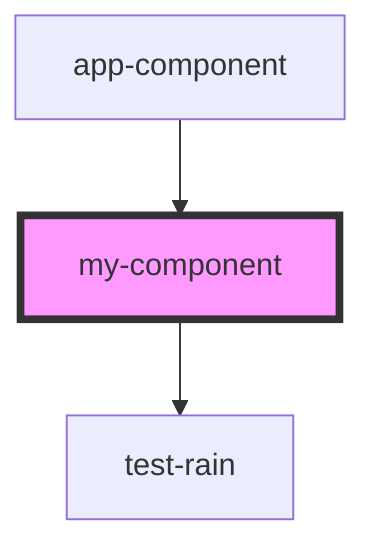

# my-component

<!-- Auto Generated Below -->

## Properties

| Property     | Attribute | Description     | Type                  | Default    |
| ------------ | --------- | --------------- | --------------------- | ---------- |
| `changeLast` | --        |                 | `(s: string) => void` | `() => {}` |
| `first`      | `first`   | The first name  | `string`              | `''`       |
| `last`       | `last`    | The last name   | `string`              | `''`       |
| `middle`     | `middle`  | The middle name | `string`              | `''`       |

## Dependencies

### Used by

 - [app-component](../app-component)

### Depends on

- [test-rain](../test-rain)

### Graph

----------------------------------------------

*Built with [StencilJS](https://stenciljs.com/)*
